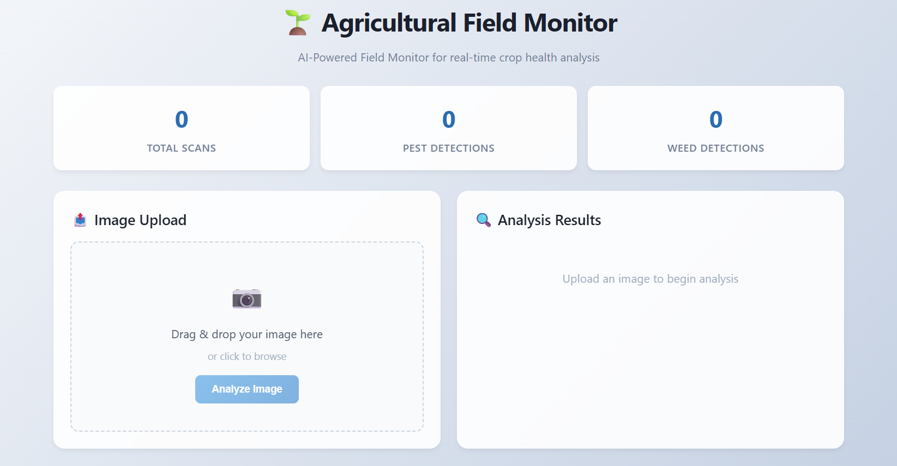
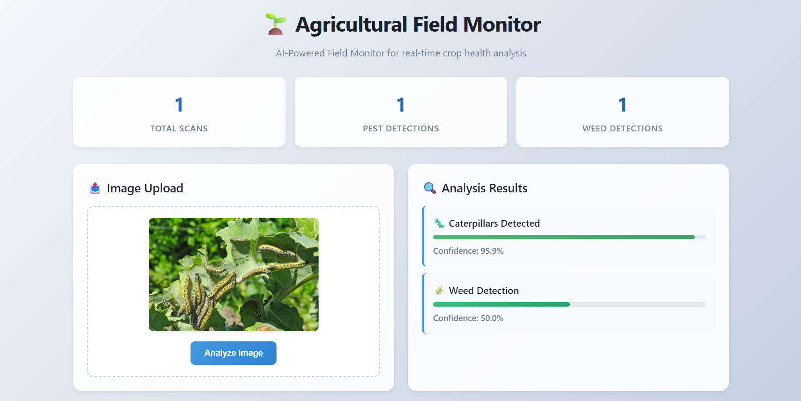
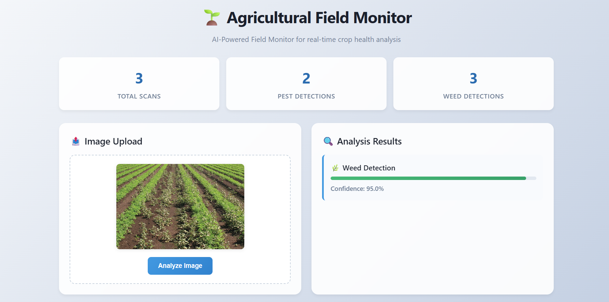

# 🌾 Agricultural Field Monitoring Using AI

A web-based application for **real-time pest and weed detection** in agricultural field images. Combines YOLOv8 for pest detection with a custom computer vision approach for weed detection — all accessible via a modern, user-friendly dashboard.

---

## 🚀 Features

- 🐛 **Pest Detection** – YOLOv8 (`pest_detector.pt`) model for accurate pest identification.
- 🌿 **Weed Detection** – Custom algorithm using OpenCV and NumPy for color, texture, and edge analysis.
- 🌐 **Web Dashboard** – Upload images, visualize results, and track statistics.
- 🔌 **API Endpoints** – Easily integrate into other tools or automation pipelines.
- 🧪 **Sample Data** – Includes images and dataset for quick testing.

---
---

## 🖼️ Demo
**Project Overview Dashboard** 

**Weed Detection Example**  

**Pest Detection Example**  

---
---
## 🗂️ Project Structure


```markdown
backend/
  ├── app.py                  # Main Flask app
  ├── ai_models/
  │   ├── pest_detector.pt    # YOLOv8 pest detection model
  │   ├── plant_disease_model.h5
  │   └── weed_segmentor.h5
  ├── uploads/                # Uploaded images
  ├── test_form.html          # Simple test upload form
  └── venv/                   # Python virtual environment
datasets/                     # Sample datasets
README.md
```

---

## ⚙️ Main Tools & Technologies

- **Python** (Flask, OpenCV, NumPy, Pillow)
- **YOLOv8** (PyTorch-based, for pest detection)
- **Keras/TensorFlow** (for plant disease/weed models, if used)
- **HTML/CSS/JavaScript** (dashboard UI)
- **Jinja2** (Flask templates)
- **Virtualenv** (Python environment)

---

## 🏃‍♂️ Quickstart

1. **Clone the repository:**
   ```bash
   git clone <repository-url>
   cd Agricultural-Field-Monitoring-Using-AI/backend
   ```

2. **Create and activate a virtual environment:**
   ```bash
   python -m venv venv
   # On Windows:
   venv\Scripts\activate
   # On Linux/Mac:
   source venv/bin/activate
   ```

3. **Install dependencies:**
   ```bash
   pip install -r requirements.txt
   ```

4. **Run the app:**
   ```bash
   python app.py
   ```

5. **Open your browser** at [http://localhost:5000](http://localhost:5000)

---

## 🧠 How It Works

- **Pest Detection:** Uses YOLOv8 model (`pest_detector.pt`) for object detection.
- **Weed Detection:** Uses OpenCV and NumPy for color/texture/edge-based segmentation.
- **Web Interface:** Built with Flask and HTML/CSS/JS for image upload and result display.

---

## 📦 Dataset

- Sample images and datasets are provided in the `datasets/` and `uploads/` folders.

---

## 🤝 Contributing

Pull requests and suggestions are welcome! Please open an issue or PR.

---

## 📄 License

[MIT License](LICENSE)

---
